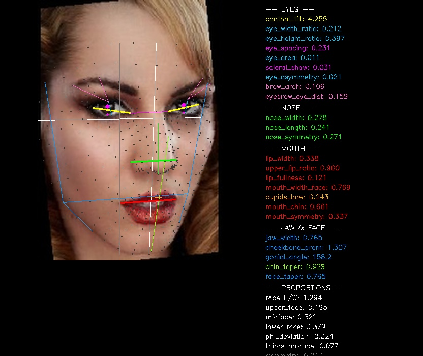
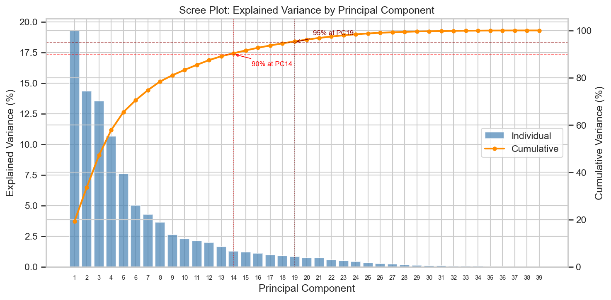
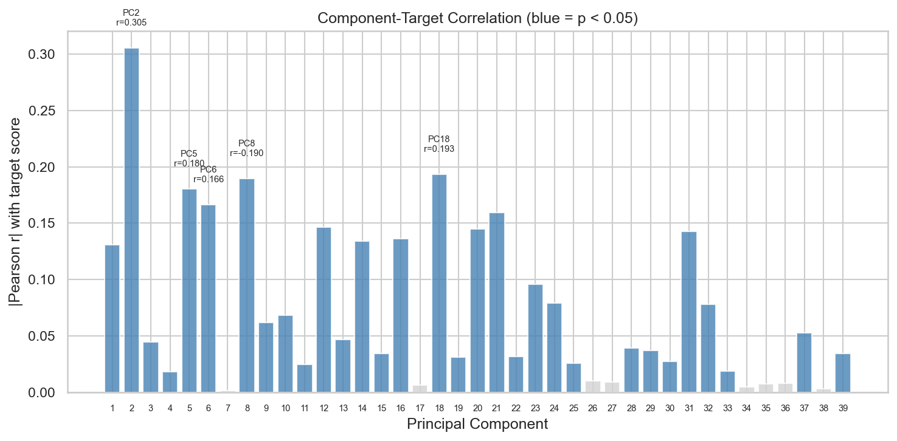

<!-- _class: cover -->

# Facial Attractiveness Prediction from Geometric Beauty Markers

## Ethnic Bias and Cross-Dataset Generalization

Team 3 — IE500 Data Mining, University of Mannheim

Maxim Froehlich, David Siregar, Timon Kuhl, Lars Bullmahn, Jagadeesh Gunti, Simon Heinz

---

# Agenda

<strong>1. Problem & Motivation</strong> 
Why facial attractiveness prediction matters and what can go wrong

<strong>2. Data & Features</strong> 
3 datasets, 17,870 faces, 30 geometric beauty markers

<strong>3. Methods</strong> 
7 models from baselines to stacking ensembles

<strong>4. Results & Fairness</strong> 
Performance, cross-dataset generalization, and ethnic bias analysis

---

<!-- _class: break -->

# Part 1: Problem & Motivation

Can facial geometry alone predict attractiveness? And is it fair?

---

# The Problem

<strong>Task:</strong> Given a face image, predict the mean attractiveness rating assigned by human annotators (supervised regression)

<strong>Challenge:</strong> Beauty is subjective, culturally shaped, and varies across ethnic groups — models can encode demographic bias

<strong>Our Approach:</strong> Use interpretable geometric features (not black-box CNNs) to understand <em>which</em> proportions drive predictions and how they differ across demographics

---

# Research Questions

<strong>RQ1:</strong> Does a model trained on limited ethnicities (Asian/Caucasian) fail on diverse populations?

<strong>RQ2:</strong> Does training on more diverse data reduce racial disparities in prediction accuracy?

<strong>RQ3:</strong> Which geometric measurements predict attractiveness, and do patterns differ across ethnic groups?

---

<!-- _class: break -->

# Part 2: Data & Features

3 datasets, 6 ethnicities, 30 beauty markers

---

# Datasets Overview

| Dataset | N | Scale | Ethnicities | Raters/Image |
|---------|---|-------|-------------|--------------|
| SCUT-FBP5500 | 5,500 | 1-5 | Asian, Caucasian | 60 |
| MEBeauty | 2,370 | 1-10 | 6 groups | ~300 |
| LiveBeauty | 10,000 | 1-5 | Asian | ~20 |

<strong>Combined: 17,870 faces</strong> — scores z-normalized per dataset to align different rating scales

---

# Ethnic Distribution

| Ethnicity | N | % |
|-----------|---:|---:|
| Asian | 14,351 | 80.3% |
| Caucasian | 2,480 | 13.9% |
| Black | 296 | 1.7% |
| Hispanic | 296 | 1.7% |
| Mid-Eastern | 291 | 1.6% |
| Indian | 156 | 0.9% |

<strong>Heavy imbalance!</strong> 
80% Asian faces due to LiveBeauty dataset. Minority groups have very few samples — this directly impacts fairness results.

---

# Feature Extraction Pipeline

Face Image

&#8594;

MediaPipe 478 Landmarks

&#8594;

30 Geometric Ratios

&#8594;

Prediction

<strong>Eyes (9 features)</strong> 
canthal_tilt, eye_width_ratio, eye_area_ratio, eye_asymmetry, ...

<strong>Nose (3 features)</strong> 
nose_width_ratio, nose_length_ratio, nose_symmetry

<strong>Mouth (7 features)</strong> 
lip_fullness, mouth_chin_ratio, cupids_bow_ratio, ...

<strong>Face & Proportions (11 features)</strong> 
facial_symmetry, jaw_width_ratio, gonial_angle, phi_deviation, ...

---

# Feature Extraction: Visualization

<strong>Color coding:</strong> 
Yellow = Canthal tilt 
Pink = Eyebrow distance 
Magenta = Eye spacing 
Green = Nose measurements 
Red = Lip/mouth features 
Blue = Jaw contour 
White = Face frame

<strong>All values are ratios</strong> 
Normalized to face width/height for scale invariance

---

# Feature Design Principles

<strong>Scale-invariant:</strong> All distances as ratios to face width/height — works regardless of resolution or distance

<strong>Roll-corrected:</strong> Canthal tilt adjusted for head rotation using inter-eye baseline angle

<strong>Symmetry-aware:</strong> 9 bilateral landmark pairs measure facial asymmetry relative to midline

<strong>Golden ratio:</strong> phi_deviation measures departure from classical proportions (1.618)

---

# PCA: Explained Variance

<strong>14 components explain 90% of variance</strong> — our 39 raw features (30 geometric + 9 expression) compress well. The first 4 PCs alone capture &gt;55%, indicating strong correlation structure among facial ratios.

---

# PCA: Which Components Predict Attractiveness?

<strong>PC2 dominates</strong> (r=0.305) 
The second principal component is most predictive of attractiveness — not the first (which captures overall face size variation).

<strong>Distributed signal</strong> 
Many PCs correlate weakly (r=0.13–0.19). Attractiveness is not captured by a single axis — it's a multi-dimensional combination of proportions.

---

<!-- _class: break -->

# Part 3: Methods

From simple baselines to stacking ensembles

---

# Model Overview

Baseline Gradient Boosting Ensemble Neural Net

| Model | Family | Key Config |
|-------|--------|-----------|
| Global Mean | Baseline | Always predicts mean score |
| XGBoost | Boosting | 1000 trees, depth 6, lr=0.05 |
| LightGBM | Boosting | 1000 trees, leaf-wise, 31 leaves |
| CatBoost | Boosting | 1000 iters, ordered boosting |
| Stacking Ensemble | Meta-learning | XGB + RF + GBR + Ridge |
| MLP | Neural Network | 128-64-32 neurons, Adam |
| Quantile XGBoost | Boosting | Predicts median (robust) |

---

# Stacking Ensemble Architecture

30 Features

&#8594;
&#8594;
&#8594;
&#8594;

XGBoost (300 trees)

Random Forest (300 trees)

Gradient Boosting

Ridge Regression

&#8594;
&#8594;
&#8594;
&#8594;

Ridge Meta-Learner

<strong>4 base learners</strong> generate out-of-fold predictions via internal 5-fold CV. A Ridge meta-learner learns the optimal blend weights. Best overall: MAE=0.554, r=0.710.

---

# Hyperparameter Optimization

<strong>Optuna (TPE Sampler, 200 trials)</strong> 
Searches over: max_depth [3-10], learning_rate [0.01-0.3], n_estimators [100-2000], subsample, colsample, regularization

<strong>Data Augmentation (4x)</strong> 
Gaussian noise (sigma=0.02) added proportionally to each feature. Simulates landmark detection variance. Training set: ~14K &#8594; ~57K samples per fold.

<strong>Evaluation: 5-Fold CV</strong> 
10% validation held out within each fold for early stopping. No information leakage between train/val/test.

---

<!-- _class: break -->

# Part 4: Results

Performance, generalization, and fairness

---

# Overall Model Performance

Holdout Test 3,574 samples Baseline MAE = 0.858

| Model | MAE | Pearson r | vs. Baseline |
|-------|-----|-----------|--------------|
| Global Mean (baseline) | 0.858 | — | — |
| Ridge Regression | 0.600 | 0.660 | -30.0% |
| XGBoost | 0.554 | 0.708 | -35.4% |
| LightGBM | 0.556 | 0.705 | -35.2% |
| CatBoost | 0.556 | 0.709 | -35.3% |
| Stacking Ensemble | 0.554 | 0.710 | -35.4% |
| **MLP** | **0.544** | **0.714** | **-36.6%** |

<strong>Key finding:</strong> All models substantially beat the baseline. Gradient-boosted trees cluster at ~35% improvement; MLP achieves best holdout MAE. Even linear Ridge shows 30% signal — geometry carries real predictive power.

---

# Results vs. Baseline: Why It Matters

<strong>Baseline = Global Mean</strong> 
Always predicts average z-score (MAE = 0.858). Any improvement must come from geometric signal.

<strong>36.6% Improvement (MLP)</strong> 
MAE drops from 0.858 &#8594; 0.544. Proves 30 facial ratios carry genuine predictive information.

<strong>Linear vs. Nonlinear</strong> 
Ridge: -30% | Trees: -35% | MLP: -36.6% 
Most signal is linear! Nonlinear models add only ~6% extra.

<strong>Tree Models Cluster</strong> 
XGBoost, LightGBM, CatBoost, Ensemble all at 0.554-0.556. Architecture choice barely matters — data quality does.

---

# Cross-Dataset Generalization

> RQ1: Does training on limited ethnicities generalize poorly?

| Experiment | MAE | Pearson r | Test N |
|-----------|-----|-----------|--------|
| SCUT &#8594; MEBeauty | 0.849 | **0.280** | 2,370 |
| SCUT &#8594; LiveBeauty | 0.764 | 0.477 | 10,000 |
| MEBeauty &#8594; SCUT | 0.770 | 0.361 | 5,500 |
| MEBeauty &#8594; LiveBeauty | 0.744 | 0.483 | 10,000 |
| LiveBeauty &#8594; MEBeauty | 0.857 | 0.418 | 2,370 |
| LiveBeauty &#8594; SCUT | 0.720 | 0.497 | 5,500 |
| **Combined (5-fold CV)** | **0.568** | **0.680** | **17,870** |

<strong>SCUT &#8594; MEBeauty: r = 0.28!</strong> Training on Asian/Caucasian data fails catastrophically on diverse populations. Combining all datasets substantially improves generalization.

---

# Comparison to CNN State-of-the-Art

SCUT-FBP5500 Benchmark

| Method | Input | Pearson r |
|--------|-------|-----------|
| ResNet-18 (Liang et al.) | Raw pixels | 0.89 |
| ArcFace + Ridge (Deng et al.) | CNN embeddings | 0.91 |
| **Our XGBoost** | **30 geometric features** | **0.71** |
| **Our MLP** | **30 geometric features** | **0.71** |

<strong>Gap Analysis:</strong> CNN r &#8776; 0.89-0.92 vs. Our r = 0.71. The 20% gap arises from fundamental differences in what each approach can learn.

<strong>Important caveat:</strong> CNN results are within-dataset (SCUT only, ethnically homogeneous). Our evaluation uses a harder multi-ethnic corpus where cross-cultural variation adds noise.

---

# Why Are There Differences to CNN Results?

<strong>1. Texture & Appearance Cues:</strong> CNNs capture skin quality, hair style, grooming, and color — features that geometry alone cannot encode. This likely accounts for the <em>majority</em> of the gap.

<strong>2. Holistic Pattern Learning:</strong> Deep networks learn high-level "gestalt" representations (face shape as a whole) rather than relying on predefined ratios between landmark pairs.

<strong>3. Evaluation Setting Differs:</strong> Published CNN results use within-dataset splits on ethnically homogeneous data. Our evaluation combines 3 datasets with 6 ethnic groups — a harder, noisier task.

<strong>Our advantage:</strong> Full interpretability + bias auditability. SHAP reveals exactly which proportions drive predictions per group — something no CNN can offer.

---

# Why Do Our Models Differ From Each Other?

<strong>Linear (Ridge): -30%</strong> 
Captures direct proportional relationships. Proves most attractiveness signal is linear in geometric ratios.

<strong>Tree Models: -35%</strong> 
Capture feature interactions and nonlinearities (e.g., wide nose + narrow eyes together). +5% over linear.

<strong>MLP: -36.6%</strong> 
Learns smooth continuous interaction surfaces. Best at modeling subtle nonlinear combinations of ratios.

<strong>Ensemble: -35.4%</strong> 
Combining diverse base learners adds robustness but not accuracy — individual trees already saturate the geometric signal.

<strong>Key insight:</strong> The 30-feature ceiling means architecture matters less than feature quality. All models converge near MAE &#8776; 0.55 — the limit of geometry-only prediction.

---

<!-- _class: break -->

# Fairness & Bias Analysis

Multi-model comparison of ethnic disparities

---

# Fairness: Multi-Model Bias Comparison

> Do different model architectures produce different fairness outcomes?

| Model | Asian | Cauc. | Black | Hisp. | Mid-E. | Indian | **Gap** |
|-------|-------|-------|-------|-------|--------|--------|---------|
| Ridge | 0.587 | 0.616 | 0.582 | 0.762 | 0.743 | 1.038 | **0.456** |
| Decision Tree | 0.648 | 0.648 | 0.689 | 0.840 | 0.716 | 1.007 | 0.359 |
| Random Forest | 0.605 | 0.635 | 0.607 | 0.780 | 0.686 | 1.020 | 0.415 |
| XGBoost | 0.552 | 0.601 | 0.616 | 0.717 | 0.718 | 0.876 | 0.324 |
| **MLP** | **0.531** | **0.575** | **0.593** | **0.698** | **0.703** | **0.851** | **0.320** |

<strong>Indian group consistently worst</strong> across ALL model families. This confirms bias is driven by <em>data scarcity</em> (N=156, vs. 14,351 Asian) — not model architecture.

---

# Absolute Fairness Gap

<strong>Fairness Gap = max(group MAE) − min(group MAE)</strong>

<strong>Gap by Model Family</strong>  
Ridge: <strong>0.456</strong> z-score 
Random Forest: <strong>0.415</strong> z-score 
Decision Tree: <strong>0.359</strong> z-score 
XGBoost: <strong>0.324</strong> z-score 
MLP: <strong>0.320</strong> z-score

<strong>Interpretation</strong>  
&#8226; More expressive models <em>reduce</em> but don't eliminate the gap 
&#8226; Range: 0.32–0.46 z-score units 
&#8226; Best-served (Asian) vs. worst-served (Indian): gap persists regardless of architecture 
&#8226; 92× fewer samples for Indian vs. Asian

<strong>Conclusion:</strong> The fairness problem is fundamentally a <em>data problem</em>. No model architecture can compensate for having 92× fewer training examples for minority groups.

---

# Bias Deep-Dive: What Drives the Gap?

<strong>Data Imbalance:</strong> 80.3% Asian, 0.9% Indian. Models learn Asian beauty patterns well but lack signal for underrepresented groups.

<strong>Annotation Bias:</strong> Raters are predominantly East Asian (LiveBeauty) — ground truth itself reflects cultural preferences of the majority group.

<strong>Feature Magnitude Differences:</strong> SHAP shows nose_width has 2.6× higher importance for Black faces (0.702) vs. Asian (0.270) — same features, different reliance patterns.

<strong>Gender Gap (small):</strong> Male MAE = 0.54, Female MAE = 0.61 (gap: 0.07). Much smaller than ethnic gap — gender is better balanced in training data.

---

# SHAP Feature Importance

> RQ3: Which features matter, and do they differ by ethnicity?

<strong>Universal Top-3</strong> 
1. Nose width ratio 
2. Eye width ratio 
3. Mouth-chin ratio 
<em>Consistent across all groups</em>

<strong>Key Difference</strong> 
For Black faces, nose_width SHAP = <strong>0.702</strong> 
For Asian faces, nose_width SHAP = <strong>0.270</strong> 
<strong>2.6× difference</strong> — same feature, vastly different reliance

<strong>Canthal tilt</strong> — despite popularity in online beauty discourse — ranks near the <em>bottom</em> of feature importance across all groups. Symmetry features also show r &lt; 0.04 (likely a MediaPipe artifact).

---

# Per-Ethnicity SHAP Breakdown

| Ethnicity | #1 | #2 | #3 | #4 | #5 | Top SHAP |
|-----------|----|----|----|----|-----|----------|
| Asian | nose_width | eye_width | eye_area | mouth_chin | lip_fullness | 0.270 |
| Black | **nose_width** | mouth_chin | eye_width | eye_area | interpupillary | **0.702** |
| Caucasian | mouth_chin | nose_width | eye_width | eye_area | upper_lip | 0.284 |
| Hispanic | nose_width | eye_width | mouth_chin | eye_area | upper_lip | 0.337 |
| Indian | nose_width | eye_width | mouth_chin | eye_area | eye_spacing | 0.340 |
| Mid-Eastern | nose_width | eye_width | mouth_chin | eye_area | eye_spacing | 0.327 |

<strong>Both universal and culture-specific patterns exist.</strong> Top-3 features are shared globally, but magnitudes and 4th/5th features vary — beauty perception has universal geometric foundations with group-specific modulations.

---

<!-- _class: break -->

# Key Takeaways

What did we learn?

---

# Summary of Findings

<strong>Geometry works:</strong> 30 facial ratios achieve r=0.714, MAE=0.544 — 36.6% improvement over baseline from simple measurements

<strong>Diversity matters:</strong> Models trained on 2 ethnicities fail on 6 (r drops from 0.71 to 0.28). Combining datasets fixes this.

<strong>Data scarcity drives unfairness:</strong> Fairness gap 0.32–0.46 z-score across all model families. Indian group (N=156) consistently worst — data problem, not model problem.

<strong>Beauty has universal + specific components:</strong> Same top-3 features everywhere, but 2.6× magnitude difference across groups.

<strong>CNN gap explained:</strong> Our r=0.71 vs. CNN r=0.89-0.92 — gap driven by texture cues and easier evaluation settings, not model weakness.

---

# Limitations

<strong>Data Imbalance</strong> 
80% Asian, 0.9% Indian. Fairness gap (0.32 z-score) reflects insufficient minority representation.

<strong>Annotation Bias</strong> 
Predominantly East Asian raters (LiveBeauty) — ground truth itself encodes majority-group preferences.

<strong>No Texture (= CNN gap)</strong> 
Geometry ignores skin, hair, grooming — explains most of the r=0.71 vs. r=0.89 gap to CNN methods.

<strong>Regression-to-the-Mean</strong> 
Std ratios 0.63–0.85: predictions compress toward zero. Ranker XGBoost partially addresses this via rank targets.

---

# Discussion: What Worked and What Didn't

<strong>Worked Well</strong> 
&#8226; Geometric features alone: 36.6% over baseline 
&#8226; Multi-dataset training: fixes cross-ethnic failure 
&#8226; SHAP interpretability: reveals group-specific patterns 
&#8226; Optuna HPO: consistent improvement across models

<strong>Fell Short</strong> 
&#8226; r=0.71 vs. CNN r=0.89 — geometry alone has a ceiling 
&#8226; Minority fairness: can't fix 92× data imbalance with algorithms 
&#8226; Symmetry features: near-zero signal (MediaPipe artifact) 
&#8226; Regression-to-mean: all models compress predictions

<strong>Central insight:</strong> The gap between our models (r=0.71) and the theoretical ceiling is split into two parts: ~50% is texture (skin, hair), ~50% is evaluation difficulty (multi-ethnic vs. single-dataset). Geometry captures the structural foundation of beauty but not its surface.

---

# Discussion: On Fairness vs. Accuracy

Can we have <strong>both</strong> high accuracy <strong>and</strong> ethnic fairness?

<strong>Evidence for YES</strong> 
&#8226; Combining datasets improved both overall MAE <em>and</em> cross-ethnic r 
&#8226; More expressive models (MLP) reduce the fairness gap (0.32 vs. Ridge 0.46) 
&#8226; Same top features globally suggests shared beauty signal

<strong>Evidence for NO (with current data)</strong> 
&#8226; Indian MAE remains 60% worse even with best model 
&#8226; Annotation bias cannot be fixed post-hoc 
&#8226; 92× sample imbalance creates irrecoverable statistical weakness

<strong>Answer:</strong> Fairness is achievable in principle, but requires <em>balanced data collection</em> — no algorithmic trick can substitute for representative training data.

---

# Outlook: Future Work

<strong>Balanced Data Collection:</strong> Acquire equal samples per ethnic group. Evaluate whether fairness gaps narrow with equal representation — testing if the problem is truly data-driven.

<strong>Rater Demographic Integration:</strong> Separate rater-ethnicity bias from ratee-ethnicity bias. Does an Asian rater rating a Black face produce systematically different scores?

<strong>Hybrid Geometry + Texture:</strong> Combine our 30 landmark features with deep embeddings (e.g., ArcFace) to close the gap to CNN SOTA while maintaining partial interpretability.

<strong>Fairness-Aware Training:</strong> Evaluate loss functions that penalize per-group disparities and quantify the accuracy-fairness tradeoff curve.

---

<!-- _class: cover -->

# Questions?

## Thank you!

Team 3 — IE500 Data Mining, University of Mannheim

<!-- Fragment reveal script - DO NOT DELETE -->

